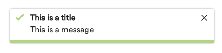

[](https://travis-ci.org/AlaskaAirlines/OrionStatelessComponents__ods-toast)


# \<ods-toast>

\<ods-toast> is custom functional web component for the purpose of exposing a user feedback interface.

## Docs

All information regarding Project Setup, Technical Details, Tests and information regarding ODS Stateless Components can be found in the [./docs](https://github.com/AlaskaAirlines/OrionStatelessComponents__docs/tree/master/docs) repository.

## Install

```shell
$ npm i @alaskaairux/ods-toast
```

### Define dependency in project component

Define the component dependency within each component that is using the \<ods-toast> component.

```javascript
import "@alaskaairux/ods-toast";
```

### Toaster.js

Use the bundled [Toaster.js](docs/Toaster.md) tool to display and manage toasts in a given interface. This dependency isn't built into the scope of the component in order to allow for consuming projects to bundle it with other project dependencies as needed.

Toaster.js is an optional--but highly recommended--utility class containing logic to manage toasts. If there is a compelling reason not to use Toaster.js, please submit an issue with the intent to resolve it.

### Swipe.js

Swipe.js is an independent dependency that will only be loaded when the user's device is detected to support [touchstart](https://developer.mozilla.org/en-US/docs/Web/API/Element/touchstart_event).

### Toaster.css / .scss

The animation of \<ods-toast> is to be installed as an external resource.

| File | Type | Import path |
|---|---|---|
| toaster.css | CSS | @alaskaairux/ods-toast/dist/toaster.css |
| toaster.scss | Sass | @alaskaairux/ods-toast/dist/toaster.scss |

### Orion Icons dependency

The \<ods-toast> custom element has a dependency on the Orion Icons library. Be sure to read the [Icons tokens install instructions](https://github.com/AlaskaAirlines/OrionIcons#icon-styles) for additional styling support.

### Design Token CSS Custom Property dependency

The use of any ODS Component has a dependency on the [ODS Design Tokens (npm install)](https://www.npmjs.com/package/@alaskaairux/orion-design-tokens). See repository and API information [here](https://github.com/AlaskaAirlines/OrionDesignTokens).

For additional details in regards to using Orion Design Tokens with components, please see [./docs/TECH_DETAILS.md](https://github.com/AlaskaAirlines/OrionStatelessComponents__docs/blob/master/docs/TECH_DETAILS.md)

### CSS Custom Property fallbacks

CSS Custom Properties are not supported in older browsers. For this, fallback properties are pre-generated and included with the npm. Any update to the Orion Design Tokens will be immediately reflected with browsers that support CSS Custom Properties, legacy browsers will require updated components with pre-generated fallback properties.

**Reference component in HTML**

```html
<ods-toast title="This is the title"></ods-toast>
```

## UI Theme Support

The \<ods-toast> custom element will support both the Classic Alaska UI and the new Orion Design UI.

### Classic UI

\<ods-toast> currently supports a Classic Alaska Airlines UI and is to ONLY be used in the Classic context.

### Orion UI

\<ods-toast> does not currently support the Orion Design UI and it not recommended to be used in Orion UI based project at this time.

## Element \<ods-toast>

```javascript
class Odstoast extends LitElement
```

### Toast use cases

The \<ods-toast> element should be used in situations where:

- alert of successful actions is passive
- message does not require interaction from user
- messages, if missed by auto dismiss, is not crucial to the users interaction

### Properties:

| Attribute | Value type   | Description                                             |
| --------- | ------------ | ------------------------------------------------------- |
| title     | string       | large bold-faced text at the top of the toast component |
| message   | string, null | smaller text that appears below the title               |
| clickCallback | function | to allow for external events to be bound within the scope of the shadow DOM |


### API Code Examples

##### Default Classic Toast


```html
<ods-toast title="This is a title"></ods-toast>
```



```html
<ods-toast title="This is a title" message="This is a message"></ods-toast>
```

##### Classic Toast with slotting


```html
<ods-toast title="This is a title" message="This is a message">
  <ods-hyperlink class="util_paddingLeft--none" href="#">Learn more</ods-hyperlink>
</ods-toast>
```

##### Loading Dynamic Toasts

Loading a dynamic experience with \<ods-toast> requires the use of Toaster.js and Swipe.js and follows a slightly different API then that of the static web component.

The following example illustrates how you could implement a use case:

```js
import "@alaskaairux/ods-toast/dist/ods-toast";
import Swipe from "@alaskaairux/ods-toast/dist/swipe.js";
import Toaster from "@alaskaairux/ods-toast/dist/toaster";
import "@alaskaairux/ods-toast/dist/toaster.css";

window.Swipe = Swipe;
const toastDuration = 7000;
const initialToastDelay = 2000;
const toasts = new Toaster(toastDuration);
setTimeout(() => {
  toasts.add("Your status has been updated");
  toasts.add("Flight information updated", "Thank you, Your seat preference has been saved");
  toasts.add("Wahoo!", "Your preferences have been updated", "Oops? <ods-hyperlink class='util_paddingLeft--none' href='/'>UNDO</ods-hyperlink>");
}, initialToastDelay);
```

Each instance of `toasts.add()` will add the \<ods-toast> custom element to the view.

> ods-hyperlink example styling; requires @alaskaairux/ods-hyperlink: ^1.0.6

> The classes `util_paddingLeft--none` and `util_paddingRight--none` can be placed on the `ods-hyperlink` element using the class attribute.


## Alternate build solutions

Why would you need this? With all Orion custom elements the CSS for the element is embedded within the shadow DOM of the custom element. If your development environment is not allowing for the use of shadow DOM elements, the CSS for each element is distributed via additional resources within the npm package.

[Read more about how to use alternate CSS build resources](https://github.com/AlaskaAirlines/OrionStatelessComponents__docs/blob/master/docs/ALT_BUILD.md)

## Development

In order to develop against this project, if you are not part of the core team, you will be required to fork the project prior to submitting a pull request.

Please be sure to review the [contribution guidelines](.github/CONTRIBUTING.md) for this project. Please make sure to **pay special attention** to the [conventional commits](.github/CONTRIBUTING.md#conventional-commits) section of the document.

### Start development environment

Once the project has been cloned to your local resource and you have installed all the dependencies you will need to open three different shell sessions. One is for the Gulp tasks, the second is for a series of npm tasks and the last is to run the Polymer server.

```shell
// shell terminal one
$ gulp dev

// shell terminal two
$ npm run dev

// shell terminal three
polymer serve
```

##

<footer>
Alaska Airlines Orion Design System<br>
Copyright 2019 Alaska Airlines, Inc. or its affiliates. All Rights Reserved.
</footer>
